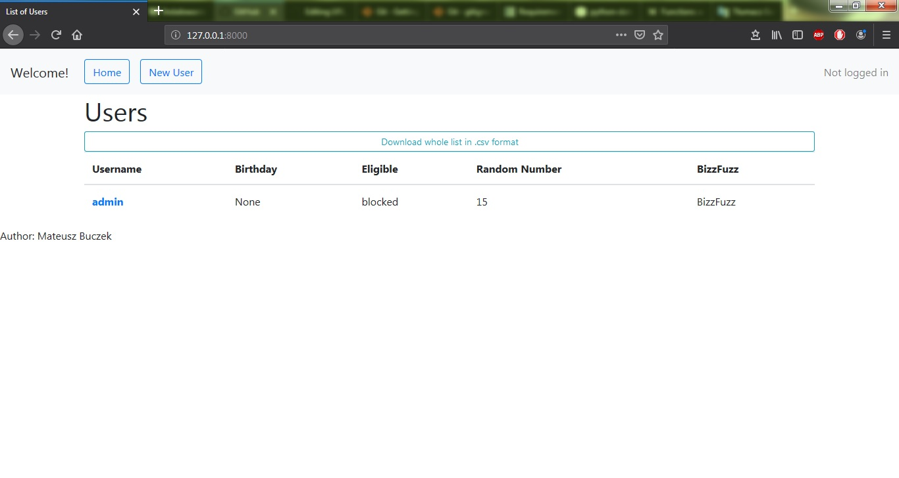
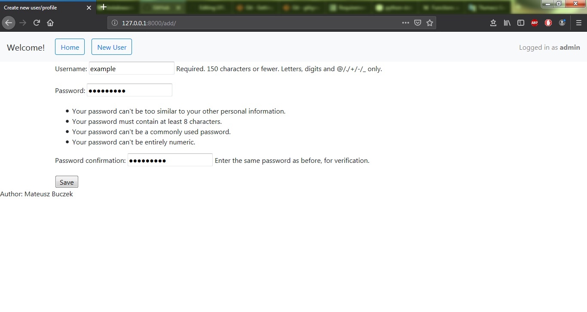
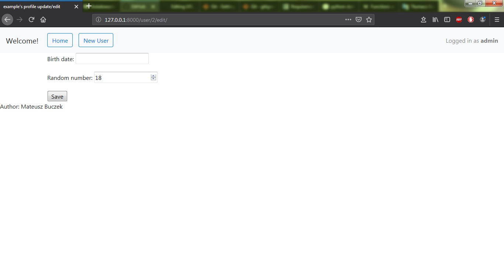
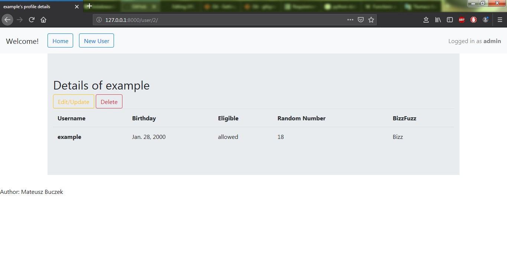
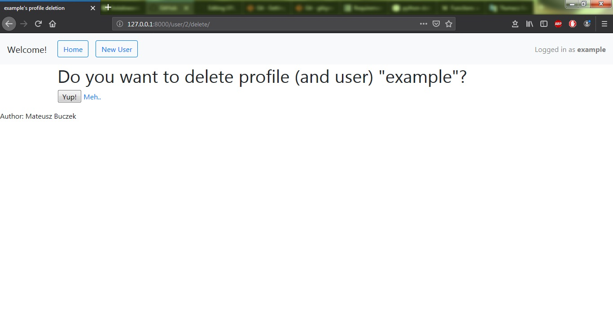

# Django task for Milo

# installation instructions 
in directory of your choice run command line and type:
```
$ git clone https://github.com/mateusz-buczek/Milo_Django_Task.git

```
go to your dir 
```
$ cd <your_dir>/Milo_Django_Task
```
create virtual environment 

```
$ python -m venv <your_venv_name>
``` 
run it 
```
$ <your_venv_name>\Scripts\activate
``` 
then install requirements (updating pip beforehand suggested)
```
$ pip install -r requirements.txt 
```
apply migrations to DB 
```
$ python manage.py migrate 
``` 
create superuser along with prompting messages
```
$ python manage.py createsuperuser 
```
and run development server 
```
$ python manage.py runserver
```
then go to http://127.0.0.1:8000/admin (or any other port provided with runserver command) and log in as created superuser to try available functions (editing and deleting allowed for logged users only). 

# release note 
* Requested functionalities work 
* Logging in/out is not provided, as it wasn't required. However keeping up with instructions above gives possibility to try it all

# screens: 

Main page: 




Creating new user/profile: 




Which then leads to completing profile info (also edit view): 




Which then leads to summary (also profile detail view containing links to edition and deletion): 




Delete(confirm or go back): 


